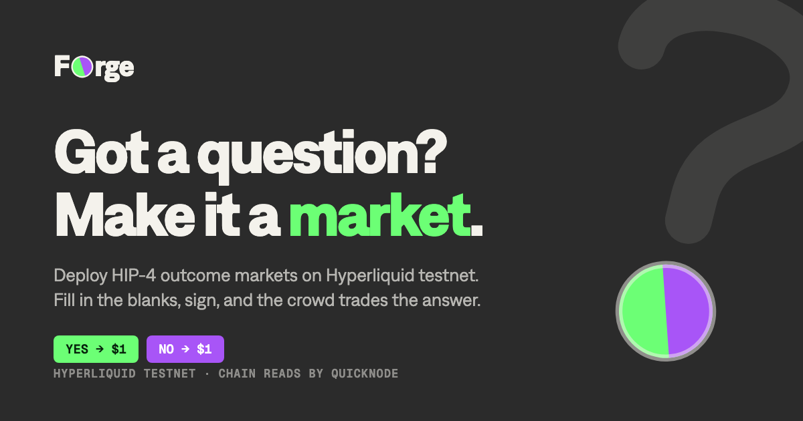
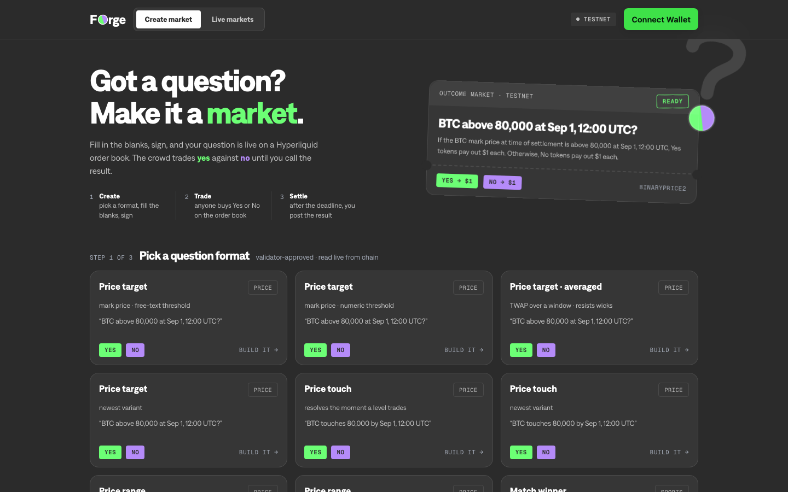
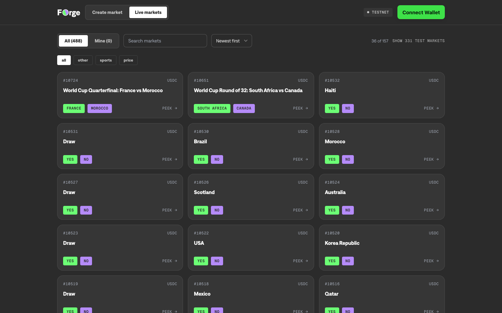
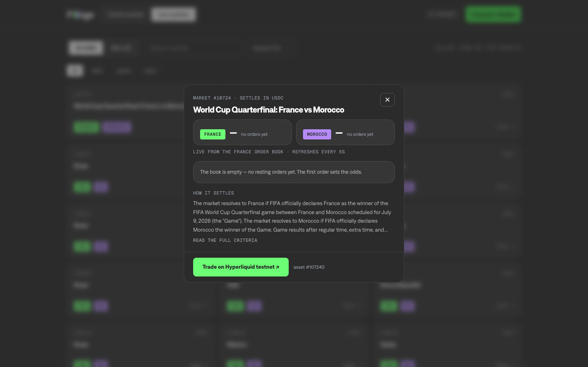

# Forge

Got a question? Make it a market.

Forge deploys HIP-4 outcome markets on Hyperliquid testnet. You pick a validator-approved question format, fill in the blanks, sign with your wallet, and your question goes live on a real order book where anyone can trade yes against no. When the deadline passes, you post the result and the winning side redeems at $1 per token.



## What's in the app

**Create.** Nine question formats, read live from the on-chain template registry: price targets (mark price, candle close, or TWAP-averaged), price touch, price ranges, sports match winners, and over/unders on any verifiable number. The wizard shows human field labels, validates as you type, converts your local time to UTC and tells you so, and renders a live ticket of exactly what will go on chain. No raw `{placeholder}` syntax anywhere.

**Live markets.** The full testnet board with search, sort (newest, oldest, A to Z), and category filters parsed from the machine metadata deployers embed in descriptions. Testnet is full of throwaway deploys named `template:whatever`; Forge hides them behind a toggle and ranks real questions first. Click any market for a detail view: implied odds for both sides, a four-level depth ladder from the live order book, the spread, and the full resolution criteria.

**Settle.** Markets you deployed appear under Mine. Settlement is a two-step armed confirmation, disabled until the market's settlement time, with a price check that reads the 1-minute candle at the settlement timestamp (not the current price) once the market is due. Every check carries evidence: the source, the value, and a sha256 of the raw response.

## Running it

```bash
npm install
npm run build
npx next start -p 5210
```

Optional `.env.local`:

| Variable | What it does |
|---|---|
| `FORGE_QN_TESTNET_ENDPOINT` | Quicknode Hyperliquid testnet endpoint. Info reads route through it server-side; the token never reaches the browser. |
| `FORGE_QN_ENDPOINT` | Quicknode Hyperliquid mainnet endpoint, used by the settlement price oracle. |
| `NEXT_PUBLIC_SITE_URL` | Public URL for OpenGraph metadata. |

Without the endpoints, reads fall back to the public Hyperliquid API.

## What deploying actually requires

This runs against Hyperliquid **testnet**. To deploy markets your wallet needs:

- 100 testnet HYPE staked as an outcome deployer
- At most 10 active outcomes at a time
- At most 50 deployments a day

Settlement is the deployer's job and wrong settlements are slashable. The app repeats this in the UI because it matters.

## How signing works

Hyperliquid L1 actions sign against a phantom EIP-712 domain: `keccak(msgpack(action) || nonce_u64_be || 0x00)` becomes the `connectionId` of an `Agent{source, connectionId}` message on chainId 1337, where source `"b"` means testnet. The app sends only `{action, nonce, signature}`.

Two hard constraints shape the architecture, both learned against the live exchange:

1. Browser wallets refuse the phantom domain. Modern MetaMask hard-rejects any typed-data signature whose domain chainId (1337) differs from the connected chain (998), at the extension level. No bypass survives this.
2. Approved agent/API wallets can only sign trading operations. Deployer-class actions (`activateOutcomeDeployer`, `outcomeDeploy`) must be signed by the deployer account itself; an agent-signed attempt fails with `Must deposit before performing actions. User: <agent address>`.

So the deployer is its own account, the way real HIP-4 operators run: Forge derives a deployer key from one ordinary `personal_sign` over a fixed message (`lib/agent.ts`). Signatures are deterministic, so the same wallet always re-derives the same deployer, on any browser — the wallet is the recovery mechanism. The key lives in localStorage as a cache, you fund it once with 100.5 HYPE on Hypercore, and it signs staking, venue activation, deploys, and settles silently as itself. The wallet's only signatures are the derivation and the funding transfer. A header chip exposes the address and a private-key backup at all times.

## The HIP-4 action schemas

These are not officially documented anywhere. They were reconstructed from community SDK source and verified against the live exchange:

```jsonc
// claim a venue (one-time; commits the stake for the 183-day minimum staking period)
{ "type": "activateOutcomeDeployer", "activate": { "venueName": "qn" } }

// deploy a standalone outcome from a template
{
  "type": "outcomeDeploy",
  "venue": "qn",
  "operation": {
    "registerStandaloneOutcomeFromTemplate": {
      "id": "binaryPrice2",
      "keywordToValue": [["perp", "BTC"], ["threshold", "80000"], ["time", "20260901-1200"]],
      "deployerFeeScale": "0"
    }
  }
}

// settle it ("1" = first side wins, "0" = second side)
{
  "type": "outcomeDeploy",
  "venue": "qn",
  "operation": {
    "settleOutcome": {
      "outcome": 10218,
      "settleFraction": "1",
      "details": "",  // must be empty; the exchange refuses anything else
      "nameAndDescription": ["<raw stored name>", "<raw stored description>"],
      "sideNames": ["<raw>", "<raw>"]
    }
  }
}
```

Settlement must echo the exchange's raw stored text (a from-template market is stored as `template:<id>` plus a `k:v|k:v` payload), not anything display-rendered. Venue names are 2 to 4 lowercase letters. Deactivating a deployer is permanent.

`keywordToValue` must be sorted by byte order. Outcome asset ids follow `#(10 * outcomeId + side)`; that string works in `l2Book` and order placement. Prices live in [0.001, 0.999], sizes are integers, collateral is USDH/USDC depending on the market.

## Data plumbing

All chain reads go through two API routes so Quicknode endpoint tokens stay server-side. The routes constrain request shape, not volume: they carry no auth or rate limit of their own, so put a rate limit in front of them before hosting publicly (see Deploying).

- `POST /api/info` rebuilds the upstream body from a per-type whitelist (`outcomeTemplates`, `outcomeMeta`, `meta`, `l2Book` with a coin, and `spotClearinghouseState`/`delegatorSummary`/`extraAgents` with a user address) and rejects everything else. Bodies over 512 bytes bounce.
- `POST /api/oracle` reads either the current mid (`allMids`) or, given a past `atMs`, the 1-minute candle at that timestamp. The response says which basis it used, and the UI treats current-price reads as indicative only.

## Design

The visual system is a small set of `--qn-*` semantic tokens with oklch values, Geist for text and display, Geist Mono for numbers, elevated surfaces as 5% overlays, and appearance that follows the OS. Forge's own layer on top: yes is green, no is purple, everywhere and always. The wordmark's "o" is a disc split between the two. Tickets get punch-hole perforations and a stamp. The question-mark glyph (a drawn hook whose dot is the split disc) appears large in the hero and small in empty states.

Screenshots:

| Create | Board | Market detail |
|---|---|---|
|  |  |  |

## Known gaps

- "Mine" is per-browser localStorage. Clear it and the settle UI for your markets is gone until you use "Find market id". Chain-side reconciliation by deployer address would fix this.
- There is no known info endpoint to check deployer stake before the first deploy attempt. The error message handles it after the fact.
- Question-type markets (multi-outcome, like rate decisions) can be browsed but not yet created; the wizard covers standalone outcomes.

## Structure

```
app/            pages, API routes, metadata, icon, OG image
components/     TemplateGallery, MarketWizard, Ticket, LiveMarkets, MarketModal, QMark
lib/            hl.ts (actions, info client), sign.ts (L1 hashing), useL1Sign.ts,
                templates.ts (humanized registry), errors.ts
```

Testnet only. Settle honestly.

## Deploying

The app is a plain Next.js project: one static page and two Node API routes. On Vercel, set these in Project Settings:

| Variable | Value |
|---|---|
| `FORGE_QN_TESTNET_ENDPOINT` | Quicknode Hyperliquid testnet endpoint URL |
| `FORGE_QN_ENDPOINT` | Quicknode Hyperliquid mainnet endpoint URL |
| `NEXT_PUBLIC_SITE_URL` | The production URL, for OpenGraph metadata |

Both routes wait up to 20 seconds on upstream, so set the function max duration to at least 25 seconds.

`/api/info` and `/api/oracle` are unauthenticated and every request spends credits on your endpoints. Add a rate limit before sharing the URL. On Vercel: Firewall, Rules, New Rule, condition `Request Path` starts with `/api/`, action `Rate Limit`, 60 requests per 60 seconds keyed by IP, then `Deny` on exceed. Adjust the numbers to your plan.

## License

MIT, see [LICENSE](LICENSE).

The Geist and Geist Mono font files in `public/fonts/` are copyright Vercel and distributed under the SIL Open Font License 1.1; the full text is in `public/fonts/OFL.txt`.
